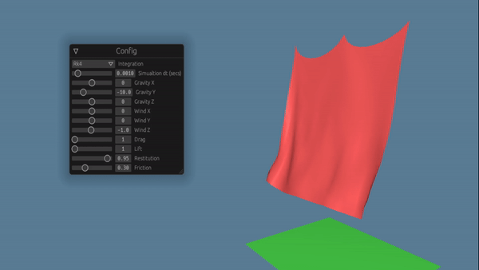
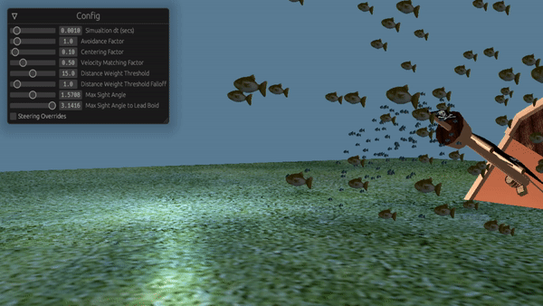
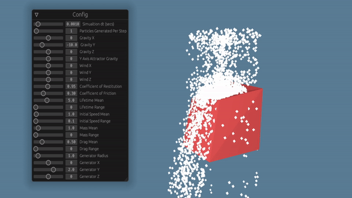

Feriphyis is a work in progress and its API is not stable. It is *not* mature. If you're looking for a Rust-based physics that's ready to use, check out the crates at https://arewegameyet.rs/ecosystem/physics/. Rapier in particular looks promising at the time of writing.

# Feriphys

Feriphys is a crate for physics simulations for computer graphics applications.

The demos/ folder contains demo applications for visualizing feriphys simulations. The render engine is built using wgpu.

# Features

## Spring-Mass-Damper Simulations

Feriphys can simulate physical objects through spring-mass-damper meshes. These meshes are collidable, model wind and drag, and are able to generate lift.

Cloth simulations are provided as a spring-mass-damper mesh with tensile, shear, and binding struts with configurable stiffness and dampening terms. Vertices may be pinned to simulate hanging cloth.

## Flocking

Flocking is implemented for simulating the motion of coordinated groups of boids.

- Configurable avoidance, centering, and velocity matching
- Parametric choreography via lead boids
- Attractors and repellers
- Distance and sightline-based boid-boid influence determination
- Obstacle avoidance via steering

## CPU-Bound Particle Simulations

CPU-bound particle simulation is available.

## Rigid Body Simulation (limited)

The library contains a very limited implementation of rigid body dynamics.

## Extensible State Representation

The State module provides numerical integration for arbitrary stateful representations of physical systems. Users can make use of it for any type they create by implementing the Stateful trait for that type. See the State tests module for examples.

## Attributions

blue_fish.obj courtesy of salmonclosebeta on Sketchfab. https://sketchfab.com/salmonclosebeta